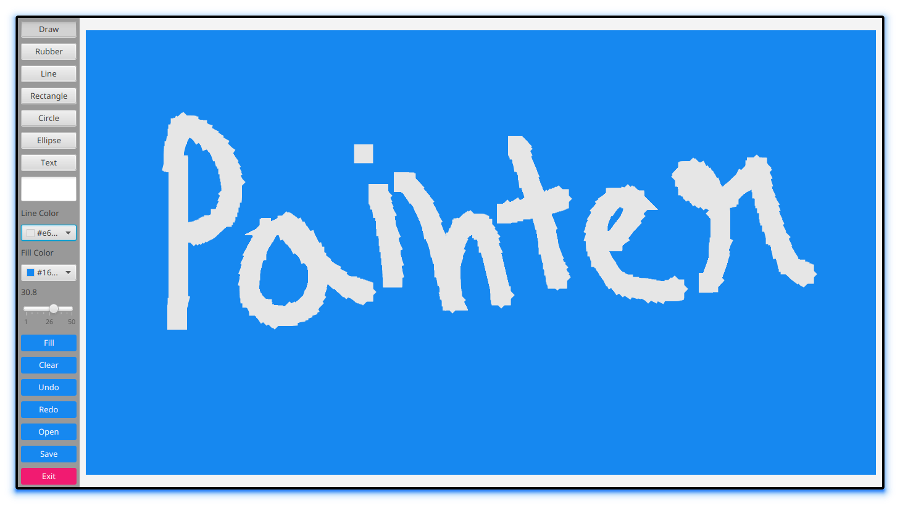

<div align = "center">

<h1><a href="https://2kabhishek.github.io/painter">Painter</a></h1>

<a href="https://github.com/2KAbhishek/Painter/blob/main/LICENSE">
 </a>

<a href="https://github.com/2KAbhishek/Painter/graphs/contributors">
 </a>

<a href="https://github.com/2KAbhishek/Painter/stargazers">
</a>

<a href="https://github.com/2KAbhishek/Painter/network/members">
 </a>

<a href="https://github.com/2KAbhishek/Painter/watchers">
 </a>

<a href="https://github.com/2KAbhishek/Painter/pulse">
 </a>

<h3>Paint your imagination 🎨🖌️</h3>

<figure>
  
  <br/>
  <figcaption>painter screenshot</figcaption>
</figure>

</div>

## What is this

Painter is a GUI app that lets you paint your imagination.

## Inspiration

Always wanted to make a paint app, discovered the JavaFX library.

## Prerequisites

Before you begin, ensure you have met the following requirements:

- You have installed the latest version of `JavaFX`

## Getting painter

To install painter, follow these steps:

```bash
git clone https://github.com/2kabhishek/painter
cd painter
```

## Using painter

Use `VS Code` to open the `painter` folder, run the `App.java` file and enjoy painting.

## How it was built

painter was built using `VS Code` and `JavaFX`.

## Challenges faced

Designing the GUI in Java was a challenge.

## What I learned

- Explored JavaFX further and learned about various features.
- Learned how to design the GUI in Java.

## What's next

Saving functionality is not working.

Hit the ⭐ button if you found this useful.

## More Info

<div align="center">

<a href="https://github.com/2KAbhishek/painter">Source</a> | <a href="https://2kabhishek.github.io/painter">Website</a>

</div>
